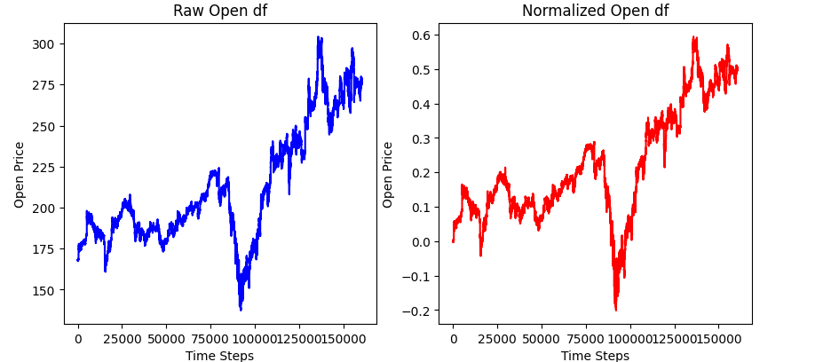
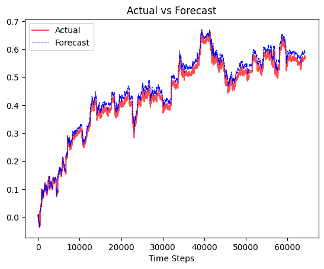
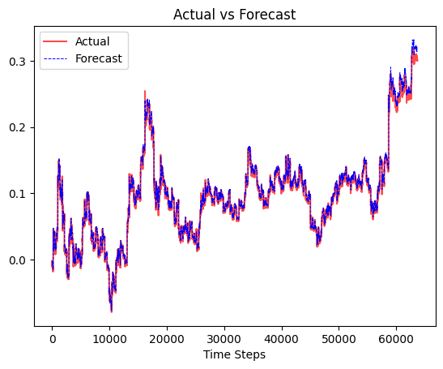

# Time Series Forecasting Using Transformer Neural Networks

[](https://www.python.org/)
[](LICENSE)


## 📜 Overview

This project demonstrates the application of **Transformer neural networks** for **time series forecasting**. Originally designed for Natural Language Processing (NLP), Transformers are proving to be highly efficient in understanding the dependencies and patterns in sequential data such as time series. This repository contains the full implementation, training, and evaluation of a Transformer-based model designed to predict future values based on past sequences.

## 🔥 Key Features

- **Transformer Model**: Implements a custom Transformer architecture specifically designed for time series data.
- **Attention Mechanism**: Exploits the self-attention mechanism to capture both short-term and long-term dependencies.
- **Scalability**: Capable of handling large time series datasets.
- **Visualization**: Visualizes the actual vs predicted time series values.
- **Performance Metrics**: Provides detailed performance metrics, including MAE, MSE, and RMSE.

## 🛠️ Installation

To run the project, clone the repository and install the required dependencies.

```bash
git clone https://github.com/rezaAdinepour/Time-Series-Forecasting.git
cd Time-Series-Forecasting
pip install -r requirements.txt
```


## 📂 Repo Structure

```plaintext
.
├── data/                                          # Folder to store input datasets
│   ├── boeing.csv                                 
│   ├── facebook.csv                               
│   └── jp_morgan.csv                              
├── model/                                         # Folder containing the saved model
│   └── time_forecasting_transformer.pth           # Trained transformer model
├── src/                                           # Source folder with code and notebook
│   └── main.ipynb                                 # Jupyter notebook for training and forecasting
├── images/                                        # Directory for saving plots and model visualization
├── requirements.txt                               # Python dependencies
└── README.md                                      # Project overview
```


## 📊 Dataset

The datasets used for this project should be a univariate or multivariate time series dataset in `.csv` format. Ensure the dataset is properly formatted with a timestamp column (if applicable) and feature columns.

we use `facebook.csv` for train model and `boeing.csv` and `jp_morgan.csv` for validate model. You can use your own custom dataset instead of this dataset.

Bellow image is `open` column of `facebook.csv` dataset:



## 🚀 Usage

After clone repo and install required dependencies, open `main.ipynb` and have fun :)


## 🧠 Model Architecture

The Transformer model consists of multiple layers of encoders and decoders. Each encoder contains:

* **Multi-head Self-Attention Mechanism:** Captures temporal relationships in the time series.
* **Feedforward Neural Network:** Provides additional non-linearity to model complex patterns.
* **Positional Encoding:** Embeds positional information, which is critical for time series.

The decoder is adapted to forecast future values based on past sequences.


## 📈 Results
In bellow you can see predicted signal of train and validation dataset:

* train:




* validation for `boeing.csv`


* validation for `jp_moegan.csv`




## 👨‍💻 Contributing

Contributions are always welcome! If you have any ideas, suggestions, or bug reports, feel free to open an issue or submit a pull request.

To contribute:

1. Fork the project
2. Create your feature branch (`git checkout -b feature/NewFeature`)
3. Commit your changes (`git commit -m 'Add some NewFeature'`)
4. Push to the branch (`git push origin feature/NewFeature`)
5. Open a pull request


## 📝 License

This project is licensed under the MIT License - see the [LICENSE](LICENSE) file for details.


## 🙌 Acknowledgements

Special thanks to the open-source community and developers who contribute to advancing machine learning and time series forecasting.
